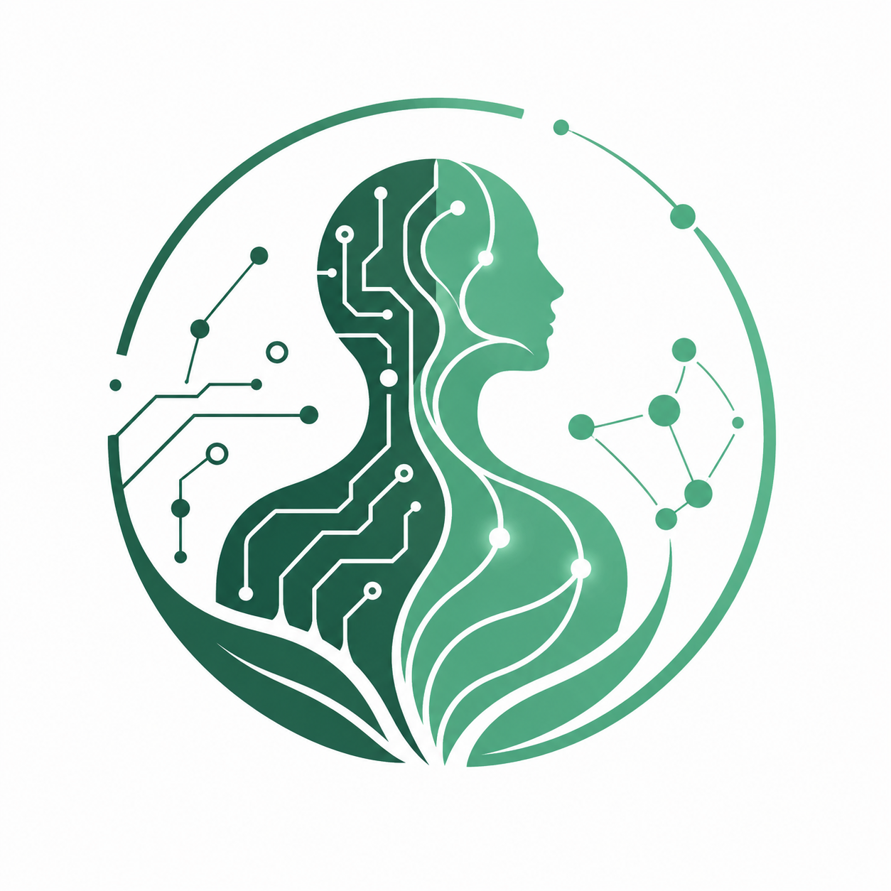
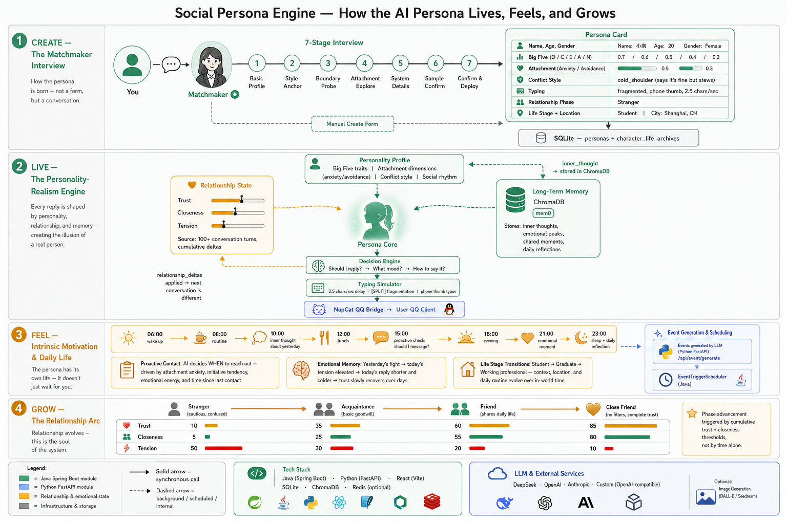

# Social Persona Simulator (AI 网友模拟器)

<p align="center">
  
</p>

<p align="center">
  <a href="./LICENSE"></a>
  <a href="#"></a>
  <a href="#"></a>
  <a href="#"></a>
</p>

<p align="center">
  <b><a href="README.md">English</a> | 简体中文</b>
</p>

---

一个**关系状态驱动**的 AI 社交模拟系统。这不是一个聊天机器人 —— 而是一个生活在你的 IM 客户端中的 AI 人格，拥有自己的性格、记忆、动机，以及对你不断演变的情感。

## 目录

- [功能特性](#功能特性)
- [架构设计](#架构设计)
- [环境要求](#环境要求)
- [快速开始](#快速开始)
- [项目结构](#项目结构)
- [配置说明](#配置说明)
- [文档](#文档)
- [致谢](#致谢)
- [许可证](#许可证)

## 功能特性

**人格创建：访谈或表单模式。** 两种创建方式：让「红娘」—— 一个 7 阶段对话式访谈代理 —— 像顾问一样引导你完成性格问题；或者使用「手动创建」表单直接填写每个参数。最终生成完整的人格档案（25+ 维度），包括大五人格特质、依恋维度、冲突风格、沟通习惯，以及完整的人生档案。

**关系状态机。** 每个人格都维护着与人类用户持续演变的关系 —— 信任度、亲密度、紧张感、情感能量、联系冲动 —— 所有这些都由交互历史塑造。这不是一个静态的角色提示词；人格对你的态度会随着每次对话而变化。

**长期向量记忆。** 基于 mem0 和 ChromaDB 构建的本地向量存储。人格能够跨会话记住关键时刻、情感高峰和个人细节。每个人格都有自己独立的记忆命名空间。

**内在动机。** 人格拥有自己的需求、情绪和日常节奏。它们不只是等待你的消息 —— 事件调度器会根据日常事件、情感状态和自然时间流逝生成主动消息。

**真实 IM 平台集成。** 所有交互都通过 QQ 进行 —— 而不是自定义聊天组件。人格通过 NapCat（OneBot V11 WebSocket）连接，使体验与真人聊天无法区分。

**图像生成（可选）。** 人格可以使用外部图像 API 生成并发送图片（自拍、风景、表情包）。支持 OpenAI 兼容的图像端点。

## 架构设计

```
┌──────────┐     ┌──────────┐     ┌─────────────────┐     ┌─────────────────┐     ┌──────────────┐
│   用户   │────▶│  NapCat  │────▶│  Java Manager   │────▶│  Python Core    │────▶│  LLM API     │
│   (QQ)   │◀────│ (OneBot) │◀────│  (Spring Boot)  │◀────│  (FastAPI)      │◀────│  (OpenAI SDK) │
└──────────┘     └──────────┘     └────────┬────────┘     └────────┬────────┘     └──────────────┘
                                           │                       │
                                           ▼                       ▼
                                    ┌────────────┐          ┌──────────────┐
                                    │   SQLite   │          │ ChromaDB     │
                                    │ (人格、    │          │ (mem0        │
                                    │  事件、    │          │  长期记忆)   │
                                    │  会话)     │          │              │
                                    └────────────┘          └──────────────┘
```

### 交互流程



1. **人格创建** — 打开 Web 管理面板 → 两个选项：红娘（7 阶段对话式访谈）或手动创建（包含所有参数的表单）→ 确认人格档案 → 部署人格
2. **日常聊天** — 用户发送 QQ 消息 → NapCat 通过 WebSocket 转发给 Java → Java 调用 Python 获取 LLM 回复 → Python 查询 mem0 获取相关记忆 → 生成带有分隔标记的回复 → Java 模拟打字延迟 → 通过 QQ 发送
3. **主动消息** — 事件调度器在配置的时间触发 → Java 调用 Python 生成事件触发的消息 → 调度消息排队 → Java 在适当时间扫描并分发
4. **记忆巩固** — 每次回复后生成内心想法 → 一天结束时（睡眠事件），生成每日反思总结当天 → 关键记忆写入长期存储

## 环境要求

| 组件 | 版本 | 必需 | 说明 |
|-----------|---------|----------|-------|
| [Java (JDK)](https://adoptium.net/) | 21+ | 是 | Spring Boot 后端 |
| [Maven](https://maven.apache.org/) | 3.6+ | 是 | Java 构建工具 |
| [Python](https://www.python.org/) | 3.12+ | 是 | LLM 编排 + 记忆系统 |
| [Node.js](https://nodejs.org/) | 18+ | 是 | 前端管理面板 |
| Redis | — | 否 | 如不可用则回退到内存缓存 |
| [NapCat QQ](https://github.com/NapNeko/NapCatQQ) | — | 是 | QQ 桥接；用户单独安装 |
| LLM API Key | — | 是 | 任何 OpenAI 兼容提供商（DeepSeek、OpenAI、Anthropic、自定义端点） |

## 快速开始

### 1. 安装依赖

```bash
# Python
cd python-core
python -m venv .venv
.venv\Scripts\activate        # Windows
pip install -r requirements.txt

# 前端
cd frontend
npm install
```

### 2. 配置 LLM 提供商

首次打开 `http://localhost:5173` 时，引导向导会指导你完成 LLM 提供商配置、图像模型设置和 QQ 账号绑定 —— 全部通过 Web UI 完成。你也可以随时在**设置**中管理提供商。

手动配置：复制模板并编辑 JSON 文件：

```bash
copy java-manager\data\system_config.example.json java-manager\data\system_config.json
```

编辑 `system_config.json`：

| 字段 | 说明 |
|-------|-------------|
| `provider` | 聊天 LLM 提供商：`deepseek`、`openai`、`anthropic` 或 `custom` |
| `apiKeyEncrypted` | 你的 API 密钥，Base64 编码 |
| `baseUrl` | API 端点（已知提供商自动填充） |
| `model` | 模型名称（如 `deepseek-chat`、`gpt-4o`） |
| `qq` | 你的 QQ 账号 |
| `imageProvider` | 图像生成提供商（可选） |
| `imageApiKeyEncrypted` | 图像 API 密钥，Base64 编码（可选） |

### 3. 启动

双击 `start.bat`。首次启动时，脚本会自动：
1. 安装 Python 依赖
2. 下载嵌入模型（`BAAI/bge-small-zh-v1.5`，约 47 MB）—— 之后本地缓存
3. 启动所有服务：Python → Java → 前端

打开 `http://localhost:5173` 访问管理面板。

单独启动各服务：

```bash
cd python-core
python -m uvicorn main:app --host 127.0.0.1 --port 8000

cd java-manager
mvn spring-boot:run

cd frontend
npm run dev
```

### 4. 连接 QQ

1. 下载并安装 [NapCat QQ](https://github.com/NapNeko/NapCatQQ)
2. 配置 OneBot WebSocket 为 `ws://127.0.0.1:8080/ws/onebot`
3. 通过管理面板创建人格 → 红娘访谈

### 5. 停止

```bash
# 停止所有服务（Windows）
双击 stop.bat
```

## 项目结构

```
├── java-manager/                     # Spring Boot 后端
│   └── src/main/java/com/socialpersona/
│       ├── matchmaker/               # 7 阶段访谈引擎
│       ├── persona/                  # 人格 CRUD + 人生档案
│       ├── message/                  # QQ 消息路由
│       ├── sim/                      # 模拟控制器
│       └── event/                    # 事件调度器
├── python-core/                      # FastAPI 核心
│   ├── api/                          # REST 端点
│   ├── engine/
│   │   ├── prompt_templates.py       # 访谈提示词模板
│   │   ├── memory.py                 # mem0 + ChromaDB 引擎
│   │   └── llm/                      # LLM 提供商适配器
│   ├── main.py
│   ├── startup_check.py              # 启动时自动下载模型
│   └── requirements.txt
├── frontend/                         # React 管理面板
├── start.bat                         # 一键启动
├── stop.bat                          # 停止所有服务
└── .github/workflows/ci.yml          # CI 流水线
```

## 配置说明

### 支持的 LLM 提供商

系统使用 OpenAI SDK 实现兼容性。支持的提供商：

| 提供商 | 聊天 | 图像生成 |
|----------|------|------------------|
| DeepSeek | 是 | 否 |
| OpenAI | 是 | 是（DALL-E） |
| Anthropic | 是 | 否 |
| 自定义（OpenAI 兼容） | 是 | 是 |

提供商元数据在 `java-manager/src/main/resources/providers.json` 中管理。

### 图像生成

当配置了 `imageProvider` 时：

1. LLM 人格会被告知它可以发送图片
2. 当人格想要发送图片时，Java 调用 Python 的 `/api/image/generate`
3. 生成的图片保存在本地，通过 OneBot CQ 码发送到 QQ

图像生成有两种模式：
- **同步**：阻塞式 —— 先生成图片，再发送（用于主动消息）
- **异步**（计划中）：非阻塞式 —— 先发送一条拖延文字，后台生成

> **注意：** 管理面板 UI 默认为中文。首次访问时会弹出语言选择窗口，也可以稍后在设置中更改。整个面板都有英文翻译可用。

## 文档

- [docs/CONTEXT.md](docs/CONTEXT.md) — 领域模型、术语和架构边界
- [docs/database-schema.md](docs/database-schema.md) — 完整的数据库模式参考

## 致谢

本项目基于以下项目的想法和基础设施构建：

| 项目 | 作用 | 许可证 |
|---------|------|---------|
| [mem0](https://github.com/mem0ai/mem0) | 长期记忆引擎（直接依赖） | Apache 2.0 |
| [Generative Agents](https://github.com/joonspk-research/generative_agents) | 核心模拟概念（斯坦福，Park 等人） | Apache 2.0 |
| [MetaGPT](https://github.com/geekan/MetaGPT) | 多智能体架构模式 | MIT |
| [LangGraph](https://github.com/langchain-ai/langgraph) | 有状态智能体编排模式 | MIT |
| [NapCatQQ](https://github.com/NapNeko/NapCatQQ) | QQ 通信桥接 | 见其仓库 |

## 许可证

[Apache License 2.0](LICENSE)
